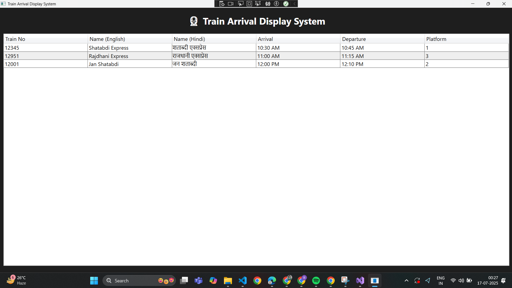

# TrainDisplaySystem
Multilingual Train Info Display App using C# and WPF
# 🚆 Multilingual Train Arrival Display System

A Windows desktop application built using **C#** and **WPF**, that simulates Indian Railways' IP-based Public Information Display System (IPPIS).  
It displays real-time train arrival/departure info in both **English and Hindi**, using data from a JSON file.

---

## 🛠️ Technologies Used

- C# with .NET Framework (WPF)
- Newtonsoft.Json for JSON parsing
- Unicode font support (Nirmala UI for Hindi)
- DispatcherTimer for auto-refresh

---

## 📋 Features

- Displays train number, names (in English + Hindi), arrival/departure times, and platform
- Data loaded from `train_data.json`
- Supports Unicode fonts for clean Hindi rendering
- Auto-refreshes train data every 60 seconds
- Professional WPF UI (dark theme with white DataGrid)
- Lightweight `.exe` build (ready to install)

---

## 📸 Screenshot



---

## 🧾 Sample train_data.json

```json
[
  {
    "TrainNo": "12345",
    "TrainNameEn": "Shatabdi Express",
    "TrainNameHi": "शताब्दी एक्सप्रेस",
    "ArrivalTime": "10:30 AM",
    "DepartureTime": "10:45 AM",
    "Platform": "1"
  },
  {
    "TrainNo": "12951",
    "TrainNameEn": "Rajdhani Express",
    "TrainNameHi": "राजधानी एक्सप्रेस",
    "ArrivalTime": "11:00 AM",
    "DepartureTime": "11:15 AM",
    "Platform": "3"
  }
]

